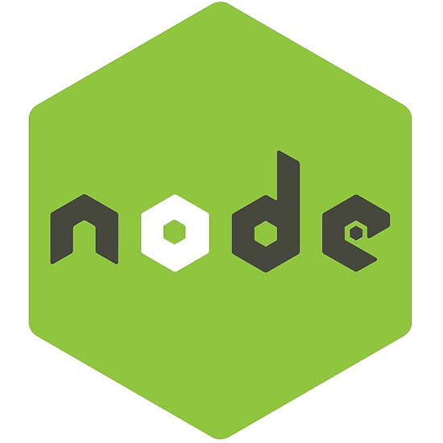

## Welcom LeeChangHyun Repository 
- Let's prepare for the  singularity that will come someday!

### Here are some ideas to get you started:
- 🔭 I’m currently working on Changwon University (Master degree)  
- 🌱 I’m currently learning Machine Learning
- 🌱 I’m currently studying Cloud Computing
- 🤔 I’m currently making the Mobile Application for card trading.

### 💡 <b> Major & Interest </b>
- Machine Learning, Cloud Computing, Application

### 📝 <b> Language & Tool</b>
-  Python &nbsp;&nbsp;
 Java &nbsp;&nbsp;
 C/C++ &nbsp;&nbsp;
 Node.js &nbsp;&nbsp;
 Pycharm &nbsp;&nbsp;
 Eclipse &nbsp;&nbsp;
 Visual Studio &nbsp;&nbsp;
 Atom &nbsp;&nbsp;

### 📫 Contact
- m.leechanghyun@gmail.com

<!--
**KoreanLeeChangHyun/KoreanLeeChangHyun** is a ✨ _special_ ✨ repository because its `README.md` (this file) appears on your GitHub profile.

Here are some ideas to get you started:

- 🔭 I’m currently working on ...
- 🌱 I’m currently learning ...
- 👯 I’m looking to collaborate on ...
- 🤔 I’m looking for help with ...
- 💬 Ask me about ...
- 📫 How to reach me: ...
- 😄 Pronouns: ...
- ⚡ Fun fact: ...
-->
