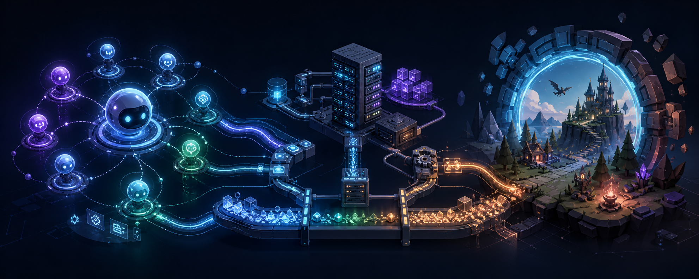

  

# 이창현 | AI Agent Developer

**AI Agent**, **FastAPI**, **Django**를 중심으로 실제 업무에 적용할 수 있는 시스템을 개발합니다.

ETL 파이프라인 구축과 데이터 통합·마이그레이션 경험을 바탕으로, 복잡한 데이터와 개발 과정을 안정적인 서비스로 연결하는 데 관심이 있습니다.
Godot으로 게임 시스템과 인터랙티브 콘텐츠도 개발하고 있습니다.

## 핵심 역량

- **AI Agent** — 에이전트 워크플로, 도구 연동, Human-in-the-loop 시스템
- **Backend** — Python, FastAPI, Django 기반 API 및 서비스 개발
- **Data Engineering** — ETL 파이프라인, 데이터 통합, 데이터 마이그레이션
- **Developer Tooling** — 반복 가능한 개발 프로세스와 자동화 도구 설계
- **Game Development** — Godot 기반 게임 시스템 구현과 프로토타이핑

## 주요 프로젝트

### [Agent Factory](https://github.com/KoreanLeeChangHyun/agent-factory)

AI 기반 소프트웨어 개발 과정을 구조화하는 프로젝트입니다. 요구사항 접수부터 작업 단위 구성, 실행, 사람의 검토까지 이어지는 개발 흐름을 하나의 생태계로 연결합니다.

- **Plugin** — Agent Factory 워크플로와 재사용 가능한 개발 역량
- **VS Code Extension** — 에디터 안에서 사용하는 Agent Factory 개발 환경
- **Web** — 프로젝트와 에이전트 작업을 관리하는 웹 인터페이스

### Wishbone *(Private)*

Godot과 GDScript로 개발 중인 게임 프로젝트입니다. 게임 시스템 구현과 플레이 프로토타이핑을 진행하고 있습니다.

## 기술 분야

<table>
  <tr>
    <td align="center" width="110">
       
      <strong>AI Agents</strong>
    </td>
    <td align="center" width="110">
       
      <strong>Python</strong>
    </td>
    <td align="center" width="110">
       
      <strong>FastAPI</strong>
    </td>
    <td align="center" width="110">
       
      <strong>Django</strong>
    </td>
    <td align="center" width="130">
       
      <strong>ETL · Integration</strong>
    </td>
    <td align="center" width="110">
       
      <strong>Godot · GDScript</strong>
    </td>
    <td align="center" width="110">
       
      <strong>Git</strong>
    </td>
  </tr>
</table>

## 연락처

- GitHub: [@KoreanLeeChangHyun](https://github.com/KoreanLeeChangHyun)
- Email: [m.leechanghyun@gmail.com](mailto:m.leechanghyun@gmail.com)

---

  <em>사람과 AI가 더 나은 방식으로 함께 일할 수 있는 시스템을 만듭니다.</em>

